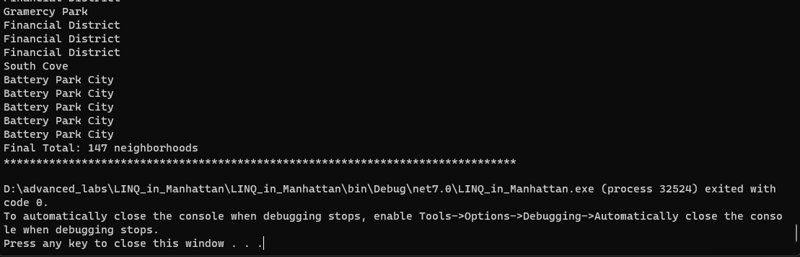

# LINQ_in_Manhattan

## Overview

This program shows the usage of LINQ to process and analyze data related to neighborhoods in Manhattan. The program reads data from a JSON file and performs various queries to extract information.

## Features

1. Output all of the neighborhoods in this data list (Final Total: 147 neighborhoods)
2. Filter out all the neighborhoods that do not have any names (Final Total: 143)
3. Remove the duplicates (Final Total: 39 neighborhoods)
4. Consolidate all the queries into a single query
5. Rewrite one of the questions using LINQ query syntax instead of method syntax

## Visuals

